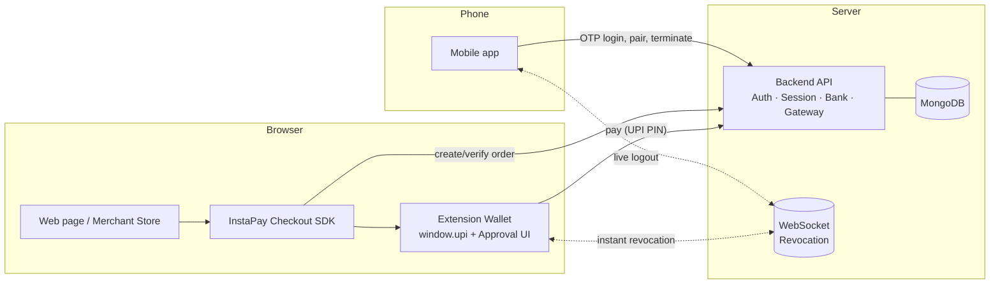
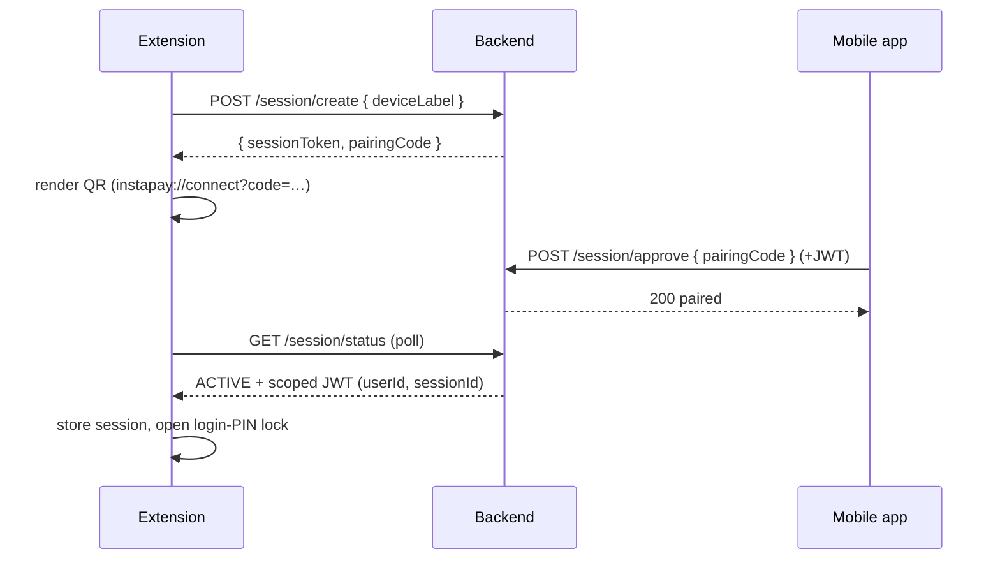
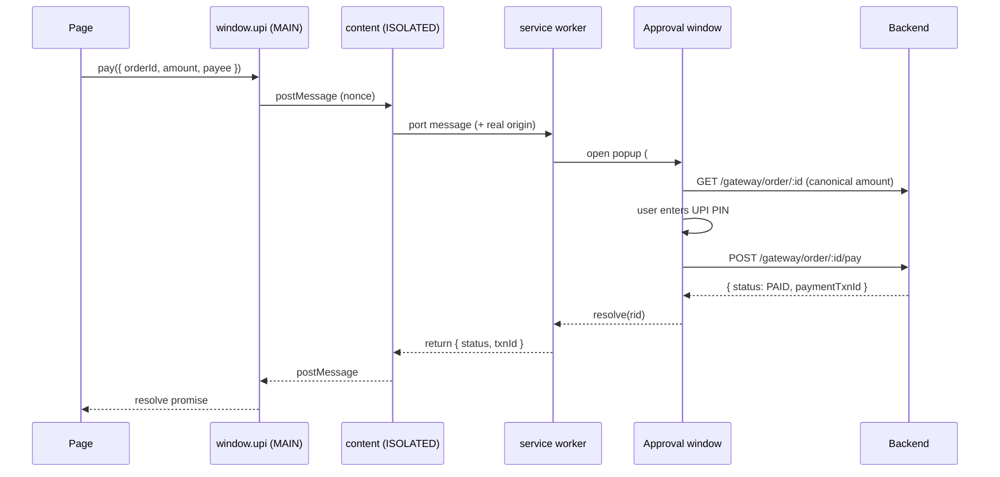
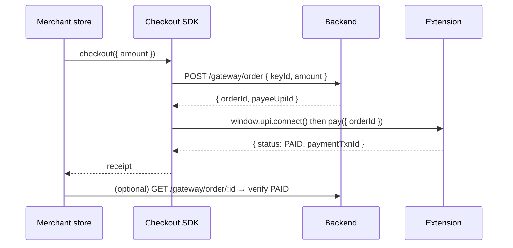

# InstaPay — A Browser-Native UPI Wallet

InstaPay is a next-generation conceptual prototype that brings **UPI payments natively into the desktop browser**, operating identically to modern Web3 wallets. 

By injecting a `window.upi` provider into web pages, InstaPay removes the friction of traditional UPI checkouts (laptop → payment gateway → mobile app → UPI PIN → wait for callback). Instead, users connect their wallet and approve transactions directly in the browser via an instant popup.

> **Disclaimer: This is a simulated prototype.** No real bank accounts, real money, NPCI, or RBI rails are involved. It exists purely to demonstrate the UX, security architecture, and technical feasibility of a browser-native UPI wallet.

---

## 🌟 The Vision

Modern web payments shouldn't require you to pull out your phone. We looked at three proven paradigms and combined them to create InstaPay:

| Inspiration | What we borrowed | How it maps to InstaPay |
|---|---|---|
| **Any UPI app** (PhonePe/GPay) | Pay via UPI ID or QR, authorize with a UPI PIN | **The Mobile App** (Command Center) |
| **WhatsApp Web** | Scan a QR on your phone to log a browser in; see & instantly revoke active sessions | **Session Pairing & Security** (Mobile ↔ Extension) |
| **Phantom / MetaMask** | Inject `window.upi`; merchants connect and request signatures | **The Browser Extension** (Wallet UI + Provider) |

Unlike crypto wallets, **keys and PINs never live in the browser**. Because UPI operates under a central authority, custody remains on the central backend (the "bank"). The browser only holds a secure, revocable session token.

---

## 🚀 Key Features

- **One-Click Web Checkout:** Merchants can request payments directly via `window.upi.pay()`, triggering a seamless approval popup in the extension.
- **Order-Based Gateway Verification:** The wallet fetches the canonical order details directly from the server backend. A maliciously tampered webpage cannot trick the user into paying a different amount.
- **WhatsApp-Style Session Pairing:** Scan a QR code on the extension from the mobile app to securely pair your devices.
- **Live Remote Kill-Switch:** Sessions are managed over raw WebSockets. If you lose your laptop, you can "Terminate" the session from your mobile app and the extension will lock instantly (<1s latency).
- **Two-Tier PIN Architecture:** A 4-digit **Login PIN** protects the local extension from prying eyes, while a highly secure **UPI PIN** is required for any actual money movement.

---

## 🎥 Demo Flows

*(See [`docs/DEMO.md`](docs/DEMO.md) for recording guides)*

| 📱 Session Pairing | 🌐 `window.upi` Pay | 🛒 Gateway Checkout | 🔒 Remote Kill-Switch |
|:---:|:---:|:---:|:---:|
|  |  |  |  |

---

## 🏗️ System Architecture

InstaPay is built across 5 distinct codebases working in harmony:



### Security Model Deep Dive
- **Strict Custody:** The browser stores only `instapay.sessionToken` + `instapay.jwt`. No PIN, account balance, or signing secret is ever persisted in `localStorage`.
- **Context Isolation:** The web page context never touches the JWT or PIN. Even the extension's background service worker never sees the PIN — only the isolated approval window (an extension popup) communicates directly with the backend.
- **Atomic Revocation:** A revoked session's JWT is instantly rejected by the API, and the WebSocket push ensures the local UI locks immediately.

---

## 🔄 Core Technical Workflows

### 1. Session Pairing (WhatsApp-Web style)



### 2. `window.upi` Connect & Pay



### 3. Gateway Checkout (Merchant View)



---

## 🛠️ Setup & Local Development

**Prerequisites:** Node.js 18+, MongoDB (local or Atlas), and Google Chrome 111+.

### 1. The Central Backend
```bash
cd backend
cp .env.example .env         # Set MONGO_URI, JWT_SECRET, PORT=5001
npm install
npm run dev                  # API runs at http://localhost:5001
```

### 2. Seed a Demo World
```bash
cd backend
npm run seed                 # Scaffolds local DB with mock users
# npm run seed -- --force    # Use if MONGO_URI is Atlas/non-local
```
*Note: This prints demo users (payer/merchant/contacts), their UPI/login PINs, and the merchant **keyId**.*

### 3. Browser Wallet (Chrome Extension)
```bash
cd web-demo
cp .env.example .env         # Set VITE_API_BASE_URL=http://localhost:5001/api
npm install
npm run build
```
*To install: Open Chrome → `chrome://extensions` → Enable Developer mode → Load unpacked → select the `web-demo/dist` folder.*

### 4. Merchant Store (Gateway Demo)
```bash
cd gateway
cp .env.example .env         # Set VITE_API_BASE + VITE_INSTAPAY_KEY (from seed)
npm install
npm run dev                  # http://localhost:5173
```

### 5. Mobile App (Command Center)
```bash
cd mobile-app
cp .env.example .env         # Set EXPO_PUBLIC_API_URL=http://<your-LAN-ip>:5001/api
npm install
npx expo start
```

---

## 🏗️ Technology Stack

- **Backend:** Node.js, Express 5, MongoDB (Mongoose), JWT, bcrypt, `ws` (WebSockets), Twilio/Nodemailer (OTP delivery).
- **Extension Wallet:** Chrome MV3, React 19, Vite, Tailwind CSS, esbuild (for content scripts).
- **Gateway & Store:** Vite, React, Framework-agnostic TypeScript Checkout SDK.
- **Mobile App:** React Native, Expo, React Navigation.

## 📝 Limitations & Scope

This is a **UX and Architecture prototype**. It features simulated custody, in-browser order creation with a public key, popup-only revocation listening, no real NPCI/RBI integration, and demo-grade authentication. See the phase design docs (`phase0.md` through `phase5.md`) for detailed scope and deliberate technical simplifications.

