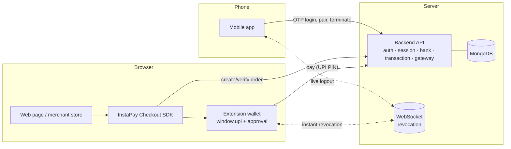
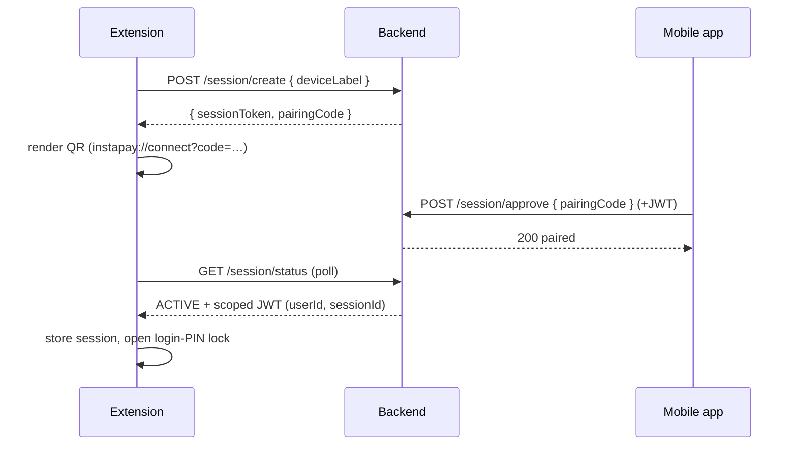
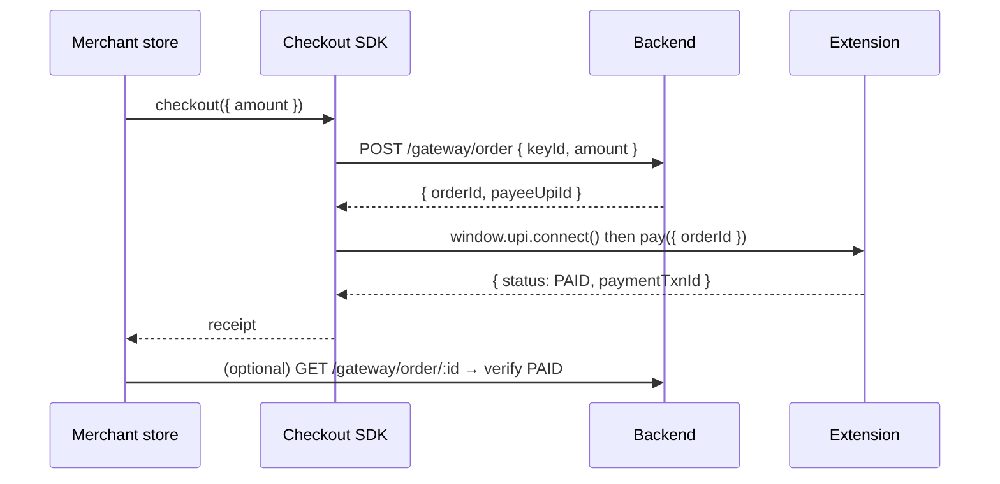
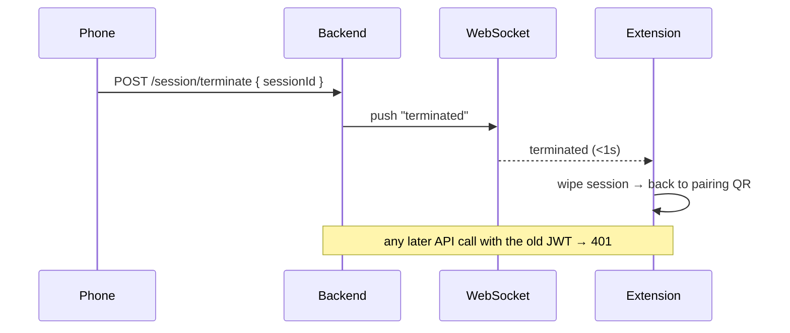

# InstaPay — a browser-native UPI wallet (simulated prototype)

InstaPay makes UPI payments work from the browser the way crypto wallets do — a page detects a `window.upi` provider, connects, and asks the wallet to pay, with an in-wallet approval popup. It removes the usual laptop → payment-gateway → phone → PIN round-trip that makes web UPI checkouts slow and flaky.

> **This is a simulated prototype.** No real bank accounts, money, NPCI, or RBI rails are involved. It exists to demonstrate the UX and architecture of a browser-native UPI wallet, not to move real funds.

---

## The idea, in one picture

Three proven products inspired the three pieces of this system:

| Inspiration | What we borrowed | Maps to |
|---|---|---|
| **Any UPI app** (PhonePe/GPay) | pay by UPI ID / QR, UPI PIN to authorize | **Mobile app** |
| **WhatsApp Web** | scan a QR on your phone to log a browser in; see & revoke active sessions | **Session pairing** (mobile ↔ extension) |
| **Phantom / MetaMask** | inject `window.upi`; a dApp connects and requests signatures | **Browser extension + `window.upi`** |

Unlike crypto wallets, **keys/PINs never live in the browser** — custody stays on the central backend (the "bank"), because UPI operates under a central authority. The browser only ever holds a session token + JWT.

---

## Demo

Four headline flows (see [`docs/DEMO.md`](docs/DEMO.md) for the recording guide; drop the GIFs into `docs/` and they render here):

| Pairing | `window.upi` pay | Gateway checkout | Remote kill-switch |
|---|---|---|---|
|  |  |  |  |

---

## Repository layout

```
Ipay/
├── backend/      Express 5 + MongoDB (Mongoose) + TypeScript — the "central bank" + gateway
├── mobile-app/   Expo / React Native — the UPI app (pay, pair browsers, manage sessions)
├── web-demo/     Chrome MV3 extension — the browser wallet (window.upi provider + approval UI)
├── gateway/      InstaPay Checkout SDK + a demo merchant store (Vite)
└── landingpage/  Marketing site
```

---

## Architecture



**Two PINs, deliberately separate**
- **Login PIN** (4-digit) — unlocks the *browser wallet* on every open. Gates access.
- **UPI PIN** — authorizes *money movement* (balance reveal, payments). The signing secret.

**Security model**
- Custody is server-side; the browser stores only `instapay.sessionToken` + `instapay.jwt`. No PIN, balance, or secret is ever in `localStorage`.
- Session revocation is **pushed over a raw WebSocket** (like WhatsApp Web), so a phone-side "Terminate" logs the extension out in well under a second — and a revoked session's JWT is rejected by the API too.
- The provider (page context) never receives the JWT/PIN; the background service worker never receives them either — only the approval window (an extension page) talks to the backend.
- The gateway is **order-based**: the wallet fetches the canonical order from the server and charges *that* amount/payee, so a tampered page can't show ₹1 while charging ₹1000. Orders are single-use.

---

## Key flows

### 1. Session pairing (WhatsApp-Web style)



### 2. `window.upi` connect + pay

```mermaid
sequenceDiagram
  participant Page
  participant Provider as window.upi (MAIN)
  participant Bridge as content (ISOLATED)
  participant BG as service worker
  participant Win as Approval window
  participant API as Backend
  Page->>Provider: pay({ orderId, amount, payee })
  Provider->>Bridge: postMessage (nonce)
  Bridge->>BG: port message (+ real origin)
  BG->>Win: open popup (#/approve?rid=…)
  Win->>API: GET /gateway/order/:id (canonical amount)
  Win->>Win: user enters UPI PIN
  Win->>API: POST /gateway/order/:id/pay
  API-->>Win: { status: PAID, paymentTxnId }
  Win-->>BG: resolve(rid)
  BG-->>Bridge-->>Provider-->>Page: { status, txnId }
```

### 3. Gateway checkout (merchant view)



### 4. Remote termination (kill-switch)



---

## Setup & run

Prereqs: Node 18+, a MongoDB (local or Atlas), and Chrome 111+.

### 1. Backend
```bash
cd backend
cp .env.example .env         # set MONGO_URI, JWT_SECRET, PORT=5001
npm install
npm run dev                  # http://localhost:5001
```

### 2. Seed a demo world (fast path)
```bash
cd backend
npm run seed                 # local DB
# npm run seed -- --force    # if MONGO_URI is Atlas/non-local
```
Prints demo users (payer/merchant/contacts), their UPI/login PINs, and the merchant **keyId**.

### 3. Browser wallet (extension)
```bash
cd web-demo
cp .env.example .env         # VITE_API_BASE_URL=http://localhost:5001/api
npm install
npm run build
# Chrome → chrome://extensions → Developer mode → Load unpacked → select web-demo/dist
```

### 4. Merchant store (gateway)
```bash
cd gateway
cp .env.example .env         # VITE_API_BASE + optional VITE_INSTAPAY_KEY
npm install
npm run dev                  # http://localhost:5173 (paste the seed keyId)
```

### 5. Mobile app
```bash
cd mobile-app
cp .env.example .env         # EXPO_PUBLIC_API_URL=http://<your-LAN-ip>:5001/api
npm install
npx expo start
```

**Demo path:** seed → open the store → *Pay with InstaPay* → the extension approval shows the server-verified order → enter the UPI PIN → success. Pair the extension from the mobile app's Scan screen; terminate it from **Linked Devices** to see the live logout.

---

## Tech stack

- **Backend:** Node/Express 5, MongoDB/Mongoose, JWT, bcrypt, `ws`, Twilio/Nodemailer (optional OTP delivery).
- **Extension:** MV3, React 19 + Vite + Tailwind (popup), esbuild-bundled content scripts (MAIN + ISOLATED worlds) + background service worker.
- **Gateway:** Vite + a framework-agnostic TypeScript Checkout SDK.
- **Mobile:** Expo / React Native, React Navigation.

## Not production

Simulated custody, in-browser order creation with a public key, popup-only revocation listening, no real NPCI/RBI integration, and demo-grade auth. It's a UX/architecture prototype — see each phase file (`phase0.md`…`phase5.md`) for scope and the deliberate simplifications.
